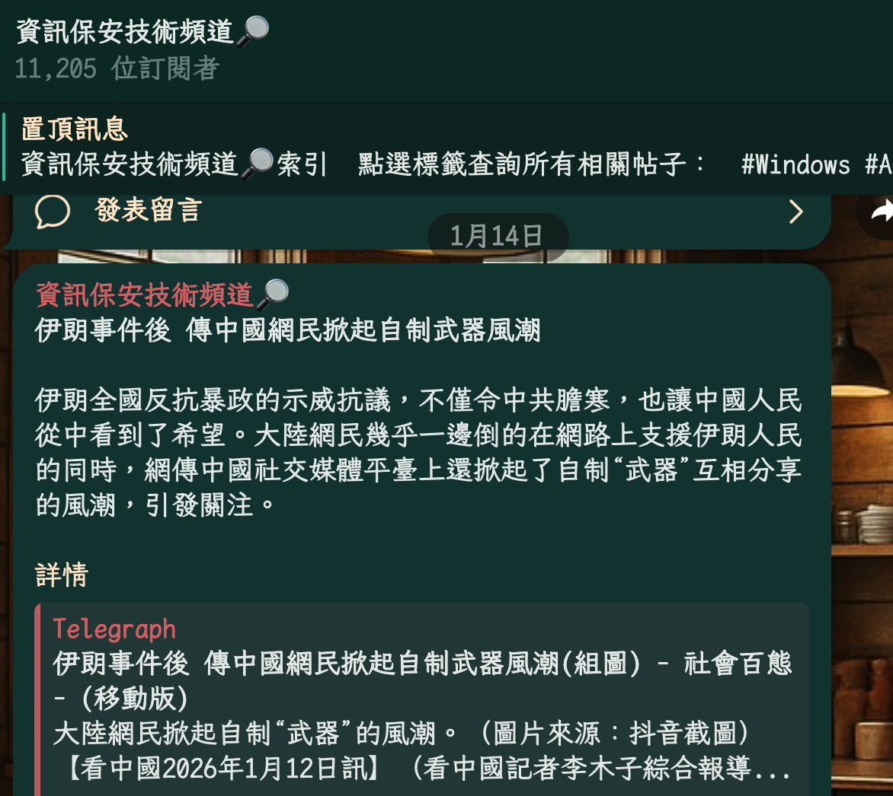

# 888文楷 - 簡體自動轉繁體

基於 **霞鶩文楷 (LXGW WenKai)** 修改，讓編輯器或閱讀器自動將簡體中文顯示為繁體。

## 核心特點
- **簡對多繁不麻煩：** 解決常見歧異字問題（例如：發→發/髮、後→後/後、幹→乾/幹/幹）。
- **閱讀體驗：** 文楷字體端正清晰，非常適合電子書閱讀。
- **橫排與等寬版本：** 同時提供一般版與 `MonoTC` 版本。

## 下載建議
- **電子書/閱讀器：** 請下載 `888LXGW-Regular_TC.ttf` (或 Light/Medium 版本)。
- **等寬需求：** 請下載 `888LXGW-MonoTC-Regular_TC.ttf`（或 Light/Medium 版本）。
- **偽直排需求：** 請查看 `Rotated90偽直排/` 資料夾。
- **網頁使用：** 請查看 `webfont/` 資料夾中的 `.woff2` 與 `fonts.css`。

## Webfont 快速使用

```html
<link rel="stylesheet" href="./webfont/fonts.css">
```

```css
body {
  font-family: '888LXGW', serif;
  font-weight: 400;
}

code, pre {
  font-family: '888LXGW Mono', monospace;
  font-weight: 400;
}
```

## 效果預覽


## 感謝與授權
- **源字體：** [霞鶩文楷](https://github.com/lxgw/LxgwWenKai)
- **授權：** 基於 SIL Open Font License 1.1 授權條款免費公開。
